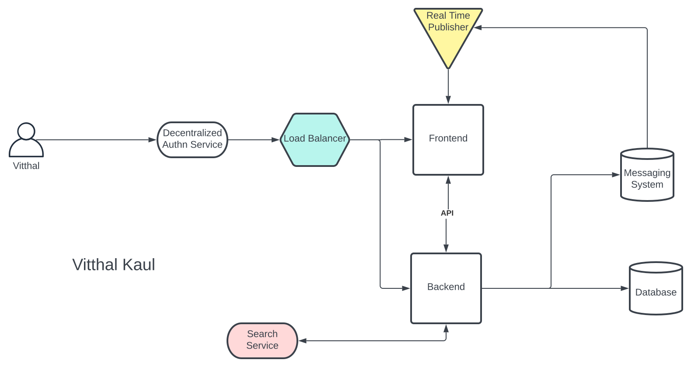

# Week 0 — Billing and Architecture

## Overview

During this week's live stream, we discussed about AWS billing, AWS architecture and AWS security. We also talked about the app (Cruddur) we are going to build. We also talked about the various different personas of the stakeholders involved in the making of this app.

We also leaned about the Iron Triangle which has 3 vertices to determine the Quality of your project. The three vertices are:
- Scope (Features, functionality)
- Cost (Budgets, Resources)
- Time (Schedule)

So if we want something quick and scope the scope of the project will be limited. This triangle tells about the various tradeoffs that one may occur while managing a project.

In the next part we learned about **"What is Good Architecture?"**:
- The project **Must** achieve some requirements which can either be technical or business oriented.
- Those requirements must be:
  - Verifiable
  - Monitorable
  - Traceable
  - Feasible
- It should address the _Risks_,_Assumptions_ and _Constraints_ of the project.

All in all this in the end in some ways ties in with the concept of the Iron Triangle.

Then we learnt about the diffent types of designs:
1. Conceptual Design: Business requirements/Concept translated into ways that can be understand by non techincal people whichh includes the way the product will function.
1. Logical Design: This is a zommed in version of the Conceptual design. It defines how the system should be implemented, included the enviroments and services to be used. It is the blueprint of the product.
1. Physical Design: It is actual represented on the product that is going to be bulit, which will be understood by the technical working on it.

Finally we learned about the __AWS Well-Architected Framework__. The AWS Well-Architected Framework is a set of practice which you can use to review your AWS workloads againsts standard AWS best practices.

It has 6 operational pillars:
- Operational Excellence
- Security
- Reliability
- Performance Efficiency
- Cost Optimization
- Sustainability

You can learn more about these 6 pillars from [here](https://aws.amazon.com/architecture/well-architected/?wa-lens-whitepapers.sort-by=item.additionalFields.sortDate&wa-lens-whitepapers.sort-order=desc&wa-guidance-whitepapers.sort-by=item.additionalFields.sortDate&wa-guidance-whitepapers.sort-order=desc).

## Required Homework

### Conceptual Diagram of Cruddur


You can view this diagram in Lucid Chart from [here](https://lucid.app/lucidchart/4224de5d-2627-429f-8534-e0a8419c20ec/edit?viewport_loc=-183%2C98%2C2075%2C947%2C0_0&invitationId=inv_be31f293-d9f6-462b-9313-3e15324159f8).

### Logical Diagram of Cruddur


You can view this diagram in Lucid Chart from [here](https://lucid.app/lucidchart/48948c93-30b3-408e-8e0b-1795cba9a759/edit?viewport_loc=-903%2C929%2C2379%2C1085%2C0_0&invitationId=inv_04005c7d-b935-406d-b11d-9c11a511a4e6).

### Create an Admin User

The AWS account we create is the _Root Account_. It is advisble to use your Root Account as minimally as possible. Instead we can create an _IAM User_  having Admin Access by assign the  `AdminstratorAccess` Policy.

1. Go the [IAM User Console](https://us-east-1.console.aws.amazon.com/iamv2/home?region=us-east-1#/users).
1. Select the User option and click on the `Add Users` button.
1.  Add the `User name`.
1. Check the button to provide the user aacess to the Management Console
1.You can either autogenerate or use a custom password to login into the Console. You can optionally choose the user to set a new password at the next sign-in.

1. Now we need to add your user to a group. In this group we will add the permission required for our new user
  - Add the name of your group.
  - Select the `AdministratorAccess` policy and click on the `Create user group`.
1. Select the group in which we want to add the user.

1. Review your changes and then create the _IAM User_.
1. Retrieve your User name and Console password with Console sign-in URL.

### Generate AWS Credentials for IAM Users
 We need to generate the credentials of the IAM user we have created. These credentials consists of the `Access key` (like username) and `Secret access key` (like password). We can use these credentails to use AWS programmatically through the AWS CLI (CLI version of AWS). Follow these steps:
 1. Choose the user for which you want to generate the credentials.
 1. Scroll down to the `Access keys` section and select the `Create access key` option.
 1. Select the `Command Line Interface (CLI)` option.
 
 1. You can set optional description tag.
 
 1. Select `Create access key` to generate the credentials.
 1. Retrieve/download your credentials.
 
### Using CloudShell

The AWS CloudShell is allows users to access the AWS via the CLI in the AWS Management Console itself. This service is not avaialable in the all the AWS Regions.

- Select the `Terminal` like icon on the top of the page to launch the AWS CloudShell.


- Use the following command to check of CloudShell is working properly:
```sh
aws s3 ls
```
The command shows the S3 buckets created.


### Installing AWS CLI

The AWS CLI provides a CLI interface to use AWS. It allows us to access AWS progamatically through our command line interface. For the CLI to know which account it is going to use we have to provide the `Access key` and `Secret access key` while configuring it.

- To manually install AWS CLI in a linux environment, use the following steps:
  ```shell
  curl "https://awscli.amazonaws.com/awscli-exe-linux-x86_64.zip" -o "awscliv2.zip"
  unzip awscliv2.zip
  sudo ./aws/install
  ```
  To configure the AWS CLI you can youse either of the following methods: 
 ```shell
 aws configure
 ``` 
 Then add/set the Access Key, Secret Access Key and the Region variables.

                                ## OR
  Use the following commands to set the following variables to the terminal
  
  ```shell
  export AWS_ACCESS_KEY_ID=""
  export AWS_SECRET_ACCESS_KEY=""
  export AWS_DEFAULT_REGION="us-east-1"
 ```
 
- To ensure the AWS CLI installs automatically even after we launch a new Gitpod environment, do the following changes in the `gitpod.yml` file to include the following task:

 ```shell
tasks:
  - name: aws-cli
    env:
      AWS_CLI_AUTO_PROMPT: on-partial
    init: |
      cd /workspace
      curl "https://awscli.amazonaws.com/awscli-exe-linux-x86_64.zip" -o "awscliv2.zip"
      unzip awscliv2.zip
      sudo ./aws/install
      cd $THEIA_WORKSPACE_ROOT
 ```
  To ensure that Gitpod remebers the AWS CLI variables after launching a new environment, do the following:
  ```shell
  gp env AWS_ACCESS_KEY_ID=""
  gp env AWS_SECRET_ACCESS_KEY=""
  gp env AWS_DEFAULT_REGION=us-east-1
  ```
  
### Create Billing Alarm

#### Enable Billing

In order to recieve alerts for billing we need to turn on `Billing Alerts`.
- Go the [Billing Dashboard Page](https://us-east-1.console.aws.amazon.com/billing/home?region=us-east-1#/) under your _Root Account_.
- Under the `Preferences` section -> `Billing preferences`
- Check the `Recieve Billing Alerts` checkbox.
- Click on `Saves Preference` 

#### Create SNS Topic

An SNS (Simple Notification Service) topic is to be created first before we can recieve billing alerts.
Our alarm will be delivered to us by the SNS service in case we cross the required threshold.
To create the SNS topic run the following command:
```shell
aws sns create-topic --name my-billing-alarm
```
After we run this command we will get a TopicARN. To create and SNS subscription for our alarm, run the following command:
```shell
aws sns subscribe \
    --topic-arn <inset your TopicARN here> \
    --protocol email \
    --notification-endpoint my-example-email@example.com
```
Our subscription will be created and we will need to confirm it from the email ID provided.

#### Creating the alarm
The mertics required to create the alarm are specfied in this [JSON](/aws/config/aws_alarm.json).

Run the following command:
```shell
aws cloudwatch put-metric-alarm --cli-input-json file://aws/config/alarm_config.json
```


### Creating a Budget

For creating a budget we need to specify our AWS account ID.
We need two JSON files while creating a budget:
- [budget](/aws/config/budget.json): The budget object that you want to create. It contains strcture of the mertics we require.
- [notifications-with-subscribers](/config/budget-notifications.json): A notification that you want to associate with a budget. It includes the threshold after which we want to send the notification to the user. It also specifies frequency to send the send the alerts and to which user.
Run the following command:
```shell
aws budgets create-budget \
    --account-id <AccountID> \
    --budget file://aws/json/budget.json \
    --notifications-with-subscribers file://aws/config/budget-notifications.json
```

