# Week 1 — App Containerization

## Required Homework

### Containerizing Applications

#### 1. Containerizing the Back end

To containerize the back end/flask module of our application, we need to create a Dockerfile and then build it to create a docker image.
In the `backend-flask` directory create a `Dockerfile` and add the following:

```
# We want to the use the 3.10-slim-buster version of python as the base of image of pur container
FROM python:3.10-slim-buster

# In our container a /backend-flask will be created and will set as the present working directory
WORKDIR /backend-flask

# Copy requirements.txt from this repo inside the container 
COPY requirements.txt requirements.txt

# Install the dependencies in the requirements.txt
RUN pip3 install -r requirements.txt

# Copy the current directory from of this repo into the current directory in the container
COPY . .

# Setting the environment variable
ENV FLASK_ENV=development

#Exposing port 4567 in the container for our flask application
EXPOSE ${PORT}

# Run the flask application the way we would run it on our system
CMD [ "python3", "-m" , "flask", "run", "--host=0.0.0.0", "--port=4567"]
```

Now we need to build our Dockerfile. The Dockerfile is basically the set of steps or a recipe on how we want are containers to be made. The building of the Dockerfiles are done in an layered manner. This means if a step fails, it can be restarted from the previous. To build this Dockerfile:

```
docker build -t  backend-flask ./backend-flask
```
After successfull completion an image named `backend-flask`  will be avaialable. 

For our Flask application to run we need to set these environment variables: 
- FRONTEND_URL='*'
- BACKEND_URL='*'

We can pass these environment ariables by ussing the `-e` parameter while using the `docker run` command.

To run our container in the background as a background process, use the following:
```
docker run -d -p 4567:4567 -it -e FRONTEND_URL='*' -e BACKEND_URL='*' backend-flask
```
We use the `-p` parameter to expose the Flask application running at port 4567 in the container at port 4567 in the host.

We can also ensure to run our container temporarily, i.e. after we exit the container, all its log will be deleted, use the `--rm` parameter:
```
docker run -rm -p 4567:4567 -it -e FRONTEND_URL='*' -e BACKEND_URL='*' backend-flask
```
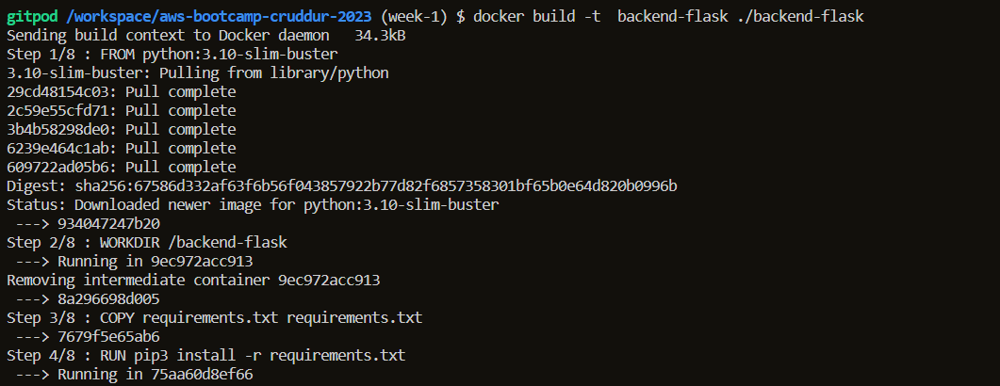
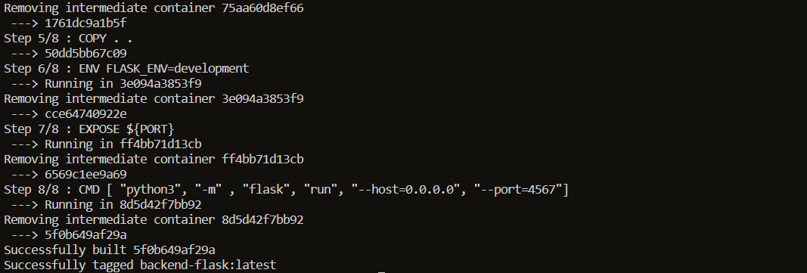
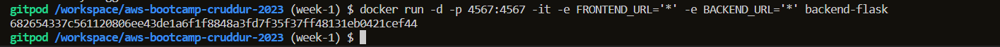
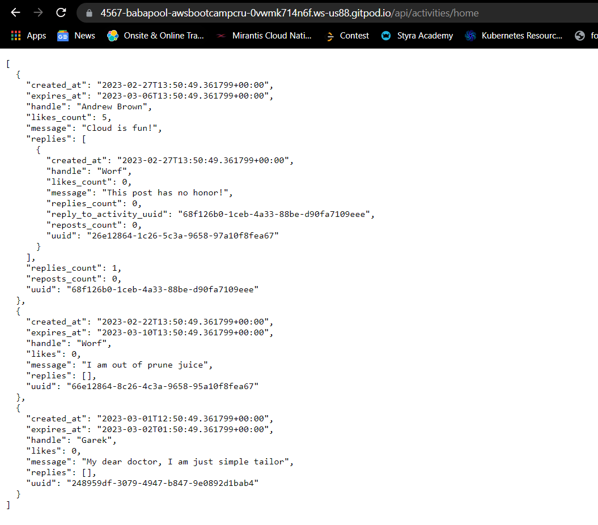

#### 2. Containerizing the Front end

To containerize the front end/react module of our application, we need to create a Dockerfile and then build it to create a docker image.
In the `frontend-react-js` directory create a `Dockerfile` and add the following:

```
FROM node:16.18

ENV PORT=3000

COPY . /frontend-react-js
WORKDIR /frontend-react-js
RUN npm install
EXPOSE ${PORT}
CMD ["npm", "start"]
```

But we to generate the node_modules so that it can be copied into the container. To install the node_modules:
```
cd frontend-react-js
npm i
```

To build this Dockerfile, run:  (We get can image named as `frontend-react-js`)
```
docker build -t frontend-react-js ./frontend-react-js
```
To run this container. run:
 ```
 docker run -p 3000:3000 -d frontend-react-js
 ```
 
 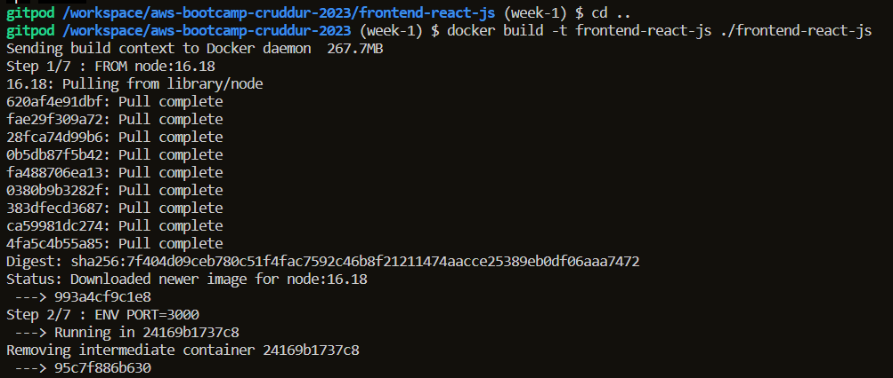
 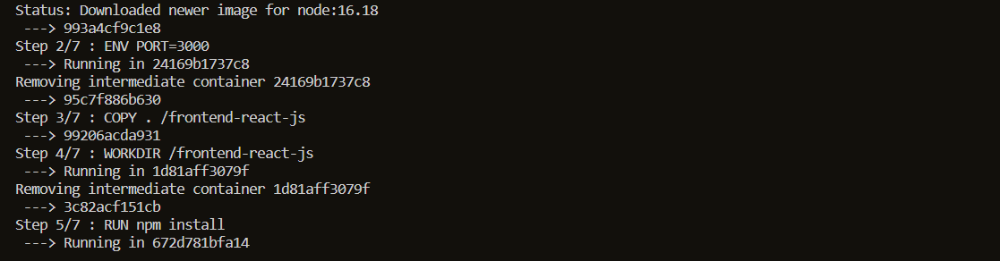
 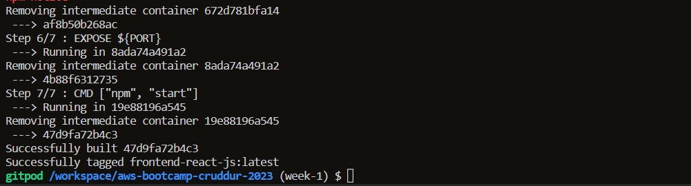
 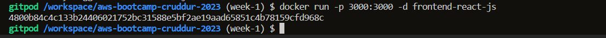
 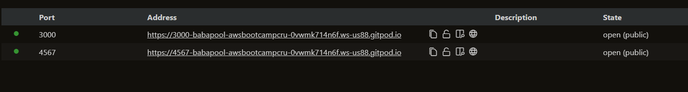
 
#### 3. Create multiple containers simulataneously using Docker compose

There are many situations where we need to use multiple containers at the same. It is not feasible to manually run the `docker run` command multiple. We can write a `docker-compose.yml` file. This file provides instructions to Docker on how to manage our many containers simultaneoulsy. In the root directory of the project, we are going to add this file:

```YAML
version: "3.8"
services:
  backend-flask:
    environment:
      FRONTEND_URL: "https://3000-${GITPOD_WORKSPACE_ID}.${GITPOD_WORKSPACE_CLUSTER_HOST}"
      BACKEND_URL: "https://4567-${GITPOD_WORKSPACE_ID}.${GITPOD_WORKSPACE_CLUSTER_HOST}"
    build: ./backend-flask
    ports:
      - "4567:4567"
    volumes:
      - ./backend-flask:/backend-flask
  frontend-react-js:
    environment:
      REACT_APP_BACKEND_URL: "https://4567-${GITPOD_WORKSPACE_ID}.${GITPOD_WORKSPACE_CLUSTER_HOST}"
    build: ./frontend-react-js
    ports:
      - "3000:3000"
    volumes:
      - ./frontend-react-js:/frontend-react-js

# the name flag is a hack to change the default prepend folder
# name when outputting the image names
networks: 
  internal-network:
    driver: bridge
    name: cruddur
```

- The `build` parameter states which Dockerfile we want to build. Alternatively use the `image` parameter to specify the image you want to use.
- The `ports` parameter states which ports needed to be mapped from the container to the host.
- The `volumes` parameter states how we want to want the persistent storage for our containers.
- The `environment` parameter is used to provide any environment variables.

To run the `docker-compose.yml` file, run:
```
docker compose up
```

To stop the `docker-compose.yml` file, run:
```
docker compose down
```
#### Note : For creating the Notification Endpoint in both the frontend and backend we will need to explore the code and to understand it.

### Write Notification Endpoint for Flask backend

Perform `docker compose up` command.

Move into the `/backend-flask` directory.

First we are going to add the notification endpoint by adding the API notation using Open API. Here we specify the actions the `api/activities/notifications` will perform. In the `backend-flask/openapi-3.0yml` file:
```YAML
/api/activities/notifications:
    get:
      description: 'Return a feed of activities for all those the user follows'
      tags:
       - activities
      parameters: []
      responses:
        '200':
          description: 'Returns an array of activities'
          content:
           application/json:
            schema:
             type: array
             items:
              $ref: '#/components/schemas/Activity'
```
 We now will make the neccessary changes in our backend code base. We first need to create `notification_activities` service and then create an API route for this API in the `app.py` file. You can view the changes done in the code base [here](https://github.com/Babapool/aws-bootcamp-cruddur-2023/commit/d2e2380f8758f82895f8cef8276ff25dbc302a2e).
 
 Refresh the application and ahead to the `/api/activities/notifications` URL can you will see results we had added in the `notifications_activities.py` file.
   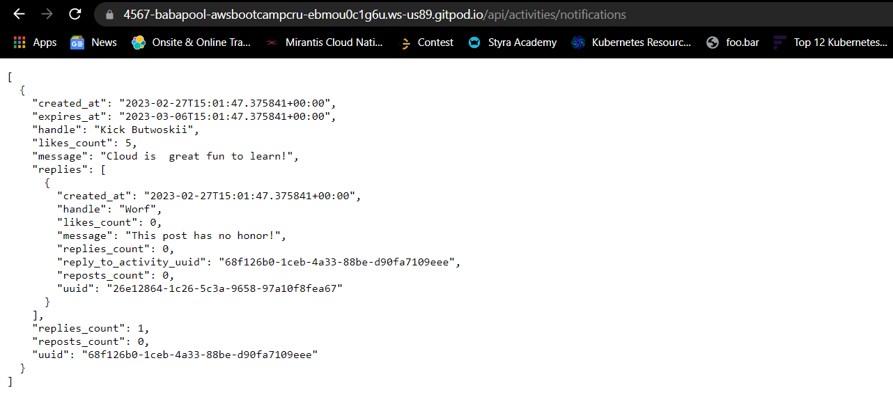
 
 ### Write Notification Endpoint for React Frontend
  
 We need to first need to create a [`NotificationsFeedPage.js`](https://github.com/Babapool/aws-bootcamp-cruddur-2023/blob/week-1/frontend-react-js/src/pages/NotificationsFeedPage.js) file in the `pages` component. The `pages` is in the directory `/frontend-react-js/src/pages`.
 
 After we made our changes in the `Pages` component we will head to the [`App.js`](https://github.com/Babapool/aws-bootcamp-cruddur-2023/blob/week-1/frontend-react-js/src/App.js) and do the neccessary changes. We will first import the file we had just created by using:
 
 ```JS
 import NotificationsFeedPage from './pages/NotificationsFeedPage';
```
 We now have to make the following changes in the `createBrowserRouter` function:
 ```JS
 {
    path: "/notifications",
    element: <NotificationsFeedPage />
  },
  ```
  
  This means whenever in the frontend we will provide the URL `/notifications` we should be redirected towards the `NotificationFeedPage` element.
  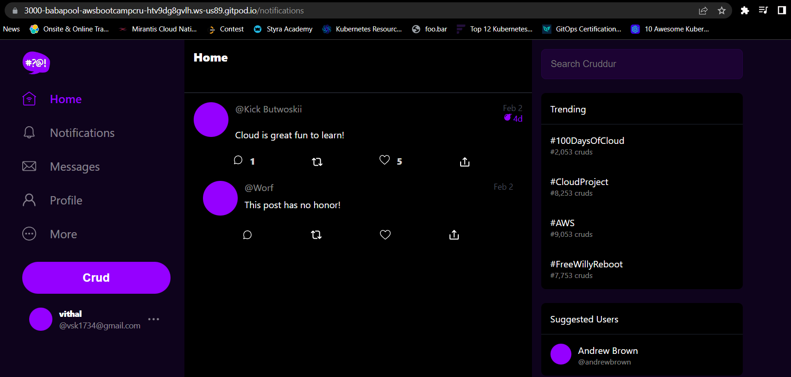
 
### Run DynamoDB Local Container and ensure it works

To spin up a DynamoDB Local container add the `dynamodb-local` service into our already created `docker-compose.yml`:
```YAML
services:
  dynamodb-local:
    # https://stackoverflow.com/questions/67533058/persist-local-dynamodb-data-in-volumes-lack-permission-unable-to-open-databa
    # We needed to add user:root to get this working.
    user: root
    command: "-jar DynamoDBLocal.jar -sharedDb -dbPath ./data"
    image: "amazon/dynamodb-local:latest"
    container_name: dynamodb-local
    ports:
      - "8000:8000"
    volumes:
      - "./docker/dynamodb:/home/dynamodblocal/data"
    working_dir: /home/dynamodblocal
```

Test your connection to the DynamoDB Local container using `aws dynamodb list-tables --endpoint-url http://localhost:8000`. This will return empty information as now tables are created.
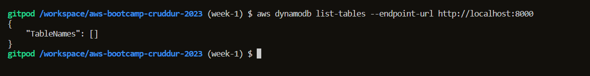
### ### Run PostgreSQL Container and ensure it works

To spin up a DynamoDB Local container add the `dynamodb-local` service into our already created `docker-compose.yml` file:
```YAML
services:
  db:
    image: postgres:13-alpine
    restart: always
    environment:
      - POSTGRES_USER=postgres
      - POSTGRES_PASSWORD=password
    ports:
      - '5432:5432'
    volumes: 
      - db:/var/lib/postgresql/data
volumes:
  db:
    driver: local
 ```
 
 We want to download and instal the PostgreSQL into Gitpod. To ensure that everytime when we launch a new environment, the driver is installed and downloaded do the following changes in the `gitpod.yml`:
 ```YAML
 - name: postgres
    init: |
      curl -fsSL https://www.postgresql.org/media/keys/ACCC4CF8.asc|sudo gpg --dearmor -o /etc/apt/trusted.gpg.d/postgresql.gpg
      echo "deb http://apt.postgresql.org/pub/repos/apt/ `lsb_release -cs`-pgdg main" |sudo tee  /etc/apt/sources.list.d/pgdg.list
      sudo apt update
      sudo apt install -y postgresql-client-13 libpq-dev
```
Install the driver can to check whether PostgresSQL is working connect to PostgreSQL using:
```psql -Upostgres --host localhost```

Enter the password and we will connected to the PostgreSQL.
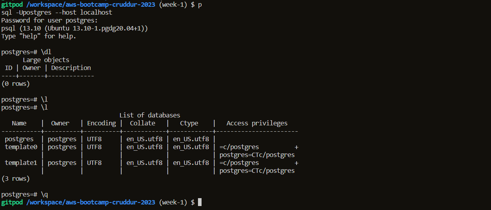

## Homework Challenges

### Push and tag an image to DockerHub

To push an image to DockerHub,

1. First we need to login into our Docker Hub account:
```
docker login
```
1. Then we need to tag our Image. While tagging our image we need to specify the Image URL. 
Here, Image URL: `userName/imageName:version`. 
The general syntax is:
``` docker tag imageNameOnHost imageURL``` 
`imageNameOnHost` -> means that you need to use the image name that is preset locally on the your system. User `docker images` command to find out.

To tag our `backend-flask` we will run:
```
docker tag backend_flask babapool/crudder_backend_flask:1.0.0
```
1. To push your image, run the following command:
``` 
docker push babapool/crudder_backend_flask:1.0.0
```
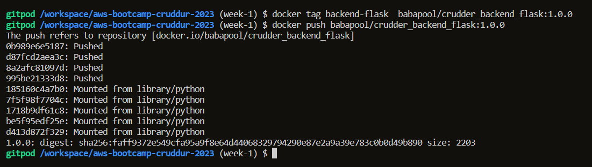

The general syntax is:
```
docker push imageURL
```

1. Visit to your repository to see your newly pushed image
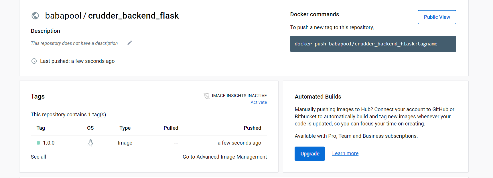

### Launch an EC2 instance that has docker installed, and pull a container to demonstrate you can run your own docker processes. 

We are are going to pull our `crudder_backend_flas:1.0.0` (the image we recently pushed) from Docker Hub in our EC2 instance.

1. We are going to launch a free tier EC2 instance having the following configuration:
- Amazon Linux 2 AMI (AMI ID: ami-006dcf) {Free tier eligible}
- t2.micro instance type {Free tier eligible}
- Key Pair 
- Since our backend application requires Port `4567` to be open for traffic, we are going to create and EC2 Security Group that will allow traffic through this port
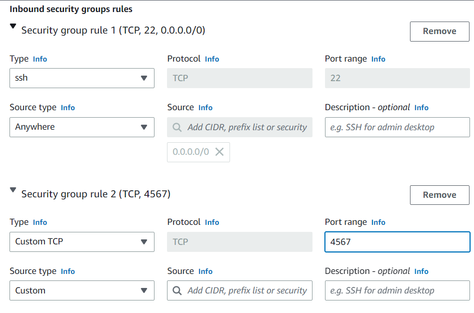

1. We are going to SSH into our EC2 instance by using the follwing command:
```
ssh -i keyPairName.pem ec2-user@public-ip
```
1. After we SSH into our EC2 instance we are going to install docker by running
```
sudo yum install docker -ce
```
Verify this by running the command ``` docker``` and get the following output:
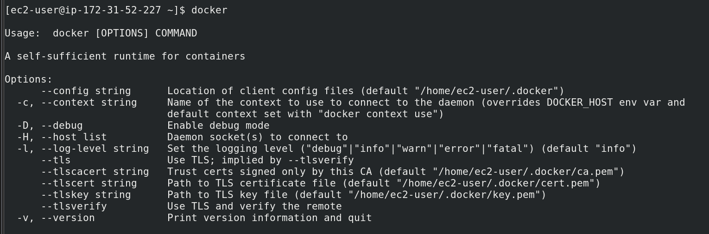

1. Start the docker service by runnning:
``` sudo systemctl start docker
```
And provide the required permissions by
```
sudo chmod 666 /var/run/docker.sock
```
1. Log into your Docker account by using the following command:
```
docker login
```
1. Pull your image using the command:
```
docker pull babapool/crudder_backend_flask:1.0.0
```
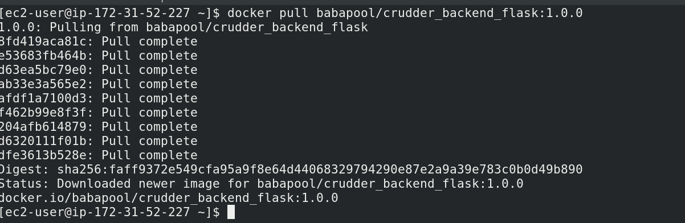

1. Run the container by using the command:
```
docker run -d -p 4567:4567 -it -e FRONTEND_URL='*' -e BACKEND_URL='*' babapool/crudder_backend_flask:1.0.0
```

1. You can verify whether the container is running by getting the website conten through the `curl` command:
```
curl localhost:4567/api/activities/notifications
```
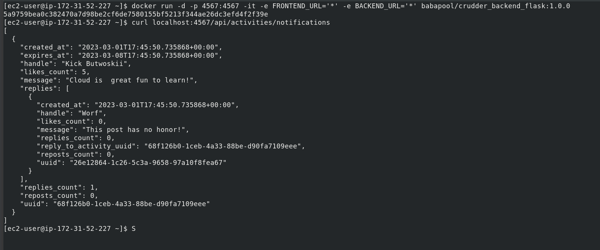
